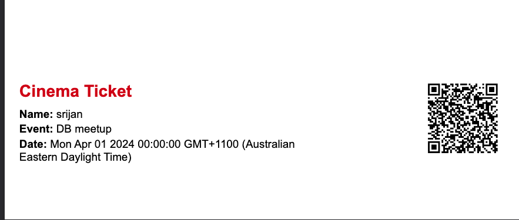

# Backend Project

This repository contains the backend code for a web application, built with TypeScript, Express, and various other libraries for seamless and secure functionality.

## Table of Contents

- [Installation](#installation)
- [Usage](#usage)
- [Scripts](#scripts)
- [Dependencies](#dependencies)
- [Dev Dependencies](#dev-dependencies)
- [Features](#features)
- [API Routes](#api-routes)

---

## Installation

1. Clone the repository:

   ```bash
   git clone <repository-url>
   ```

2. Navigate to the project directory:

   ```bash
   cd backend
   ```

3. Install dependencies:
   ```bash
   npm install
   ```

---

## Usage

### Development Mode

To start the server in development mode with live reload:

```bash
npm run dev
```

### Production Mode

To build and start the server:

```bash
npm run start
```

---

## Scripts

- **start**: Compiles TypeScript code and starts the server from the `dist` directory.
- **dev**: Compiles TypeScript code and starts the server with `nodemon` for live reload.
- **test**: Placeholder for future tests.

---

## Dependencies

- **[@types/bcryptjs](https://www.npmjs.com/package/@types/bcryptjs)**: Type definitions for bcryptjs.
- **[@types/cors](https://www.npmjs.com/package/@types/cors)**: Type definitions for CORS.
- **[@types/jsonwebtoken](https://www.npmjs.com/package/@types/jsonwebtoken)**: Type definitions for JSON Web Token.
- **[@types/morgan](https://www.npmjs.com/package/@types/morgan)**: Type definitions for Morgan logging middleware.
- **[bcryptjs](https://www.npmjs.com/package/bcryptjs)**: Library for hashing passwords.
- **[cors](https://www.npmjs.com/package/cors)**: Middleware for enabling CORS.
- **[dotenv](https://www.npmjs.com/package/dotenv)**: Loads environment variables from a `.env` file.
- **[express](https://www.npmjs.com/package/express)**: Web framework for Node.js.
- **[ioredis](https://www.npmjs.com/package/ioredis)**: Redis client for Node.js.
- **[joi](https://www.npmjs.com/package/joi)**: Data validation library.
- **[jsonwebtoken](https://www.npmjs.com/package/jsonwebtoken)**: For creating and verifying JWT tokens.
- **[morgan](https://www.npmjs.com/package/morgan)**: HTTP request logger middleware for Node.js.
- **[pg](https://www.npmjs.com/package/pg)**: PostgreSQL client for Node.js.
- **[stripe](https://www.npmjs.com/package/stripe)**: Node.js library for Stripe payments.

---

## Dev Dependencies

- **[@types/dotenv](https://www.npmjs.com/package/@types/dotenv)**: Type definitions for dotenv.
- **[@types/express](https://www.npmjs.com/package/@types/express)**: Type definitions for Express.
- **[@types/ioredis](https://www.npmjs.com/package/@types/ioredis)**: Type definitions for ioredis.
- **[@types/mongoose](https://www.npmjs.com/package/@types/mongoose)**: Type definitions for Mongoose.
- **[@types/node](https://www.npmjs.com/package/@types/node)**: Type definitions for Node.js.
- **[@types/pg](https://www.npmjs.com/package/@types/pg)**: Type definitions for PostgreSQL.
- **[mongoose](https://www.npmjs.com/package/mongoose)**: MongoDB object modeling for Node.js.
- **[typescript](https://www.npmjs.com/package/typescript)**: TypeScript compiler.

---

## Features

- **TypeScript**: Statically typed code for better reliability.
- **Environment Configuration**: Manage sensitive configuration with dotenv.
- **Data Validation**: Ensure data integrity using Joi.
- **Authentication**: Secure user authentication and session management with bcryptjs and JWT.
- **Database Integration**:
  - PostgreSQL support with `pg`.
  - MongoDB modeling with Mongoose.
- **Redis Integration**: Cache and data management using ioredis.
- **Payment Gateway**: Stripe for handling payments.
- **CORS Support**: Handle cross-origin requests with ease.
- **Logging**: Morgan for efficient HTTP request logging.

---

## API Routes

The API is organized under the `/event-ticketing/api/v1` base path:

- **User Routes**: Handled by `userRouter`.

- **Event Routes**: Protected by `auth` middleware and handled by `eventRouter`.

- **Booking Routes**: Protected by `auth` middleware and handled by `bookingRouter`.

---

## Generated ticket

## 

Feel free to open issues or contribute to the project to enhance its functionality!
